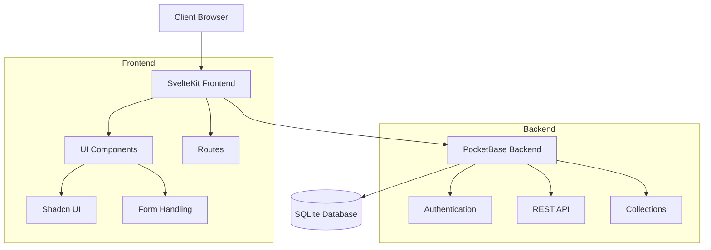
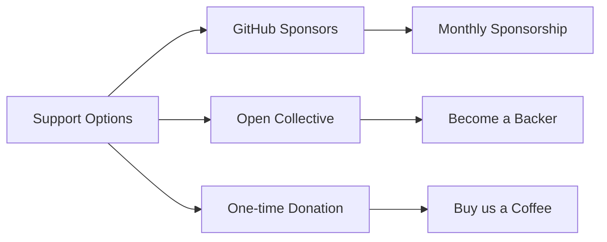

# fli.so - URL Shortener

fli.so is a URL shortener built with SvelteKit and PocketBase. It provides a clean and simple interface for shortening long URLs into short, memorable links.

## Architecture



## Features

- **URL Shortening:** Shorten long URLs using a custom or automatically generated slug.
- **Customizable Slugs:** Create your own short URLs.
- **Click Tracking:** Track the number of clicks on each shortened URL.
- **Clean UI:** Modern and user-friendly interface.
- **Keyboard Shortcuts:** Efficient navigation and actions using keyboard shortcuts. (See the help dialog for details).
- **Tags:** Organize URLs with custom tags.
- **Password Protection:** Optional password protection for links.
- **Meta Data:** Custom meta title, description and image for links.
- **QR Codes:** Generate QR codes for shortened URLs.
- **Expiration:** Set expiration dates for links.
- **Analytics:** Basic click analytics.
- **Multi-user:** Support for multiple users and organizations.

## Tech Stack

- **Frontend:** SvelteKit 2.0 with Svelte 5's Runes
- **Backend:** PocketBase (self-hosted)
- **Database:** SQLite (via PocketBase)
- **UI Components:** Shadcn UI
- **Styling:** Tailwind CSS
- **Forms:** Superforms + Zod
- **Package Manager:** Bun
- **Containerization:** Docker

## Setup

1. **Clone the repository:**

   ```bash
   git clone <repository_url>
   ```

2. **Install dependencies:**

   ```bash
   bun install
   ```

3. **Start PocketBase (if not already running):** This project uses a self-hosted PocketBase instance. You can start it using:

   ```bash
   npm run pocketbase:dev  # or the equivalent Bun command if available.  Check your package.json. Or you can skip this step and check the step 5.
   ```

   (This command starts PocketBase in development mode on `http://localhost:8090`. Adjust the port if necessary.)

4. **Generate PocketBase types:**

   ```bash
   bun run typegen
   ```

   This will generate the types for the PocketBase collections and save them in the `types` folder.

5. **Run the development server:**

   ```bash
   bun run start # this will start the SvelteKit app and the PocketBase server on different ports together.
   ```

6. **Visit:** `http://localhost:5173`
7. **For admin access to PocketBase, visit:** `http://localhost:8090/_/`
   1. Create an admin user.
   2. Now you will be able to see tables already created in the `collections` folder.
   3. You can also create new collections from the UI.

## Deployment

Deployment instructions will be added later.

## Contributing

Contributions are welcome! Please open an issue or submit a pull request.

## Support the Project

If you find fli.so useful, please consider supporting its development. I'm currently focusing full-time on building open source business tools, with fli.so being part of a larger vision that includes [dunsuite.com](https://dunsuite.com) - a modern, open source alternative to traditional work tools.

Your support helps make sustainable open source development possible and enables me to keep building tools that respect user privacy and freedom.



- **GitHub Sponsors:** Support through [GitHub Sponsors](https://github.com/sponsors/thisux)
- **Open Collective:** Join our [Open Collective](https://opencollective.com/fliso)
- **One-time Donation:** 
  - Buy us a coffee via [Ko-fi](https://ko-fi.com/thisux)
  - Crypto: 
    - ETH: `0x...`
    - BTC: `bc1...`

All sponsors get:
- ✨ Priority support
- 🔥 Early access to new features
- 🎯 Vote on roadmap priorities
- 💪 Support truly open source business software

> "I believe business tools should be open source, privacy-respecting, and community-driven. Your support helps make this vision a reality." - [@thisux](https://github.com/thisuxhq)

## License and Copyright

Copyright 2024 THISUX PRIVATE LIMITED

Licensed under the Affero General Public License (AGPL-3.0)
